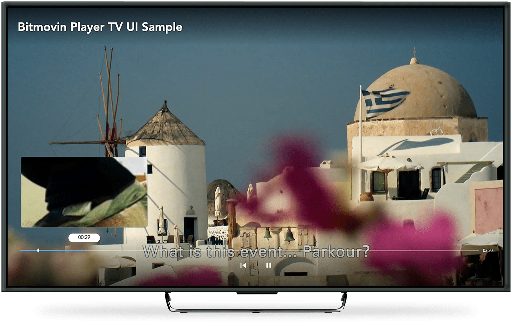
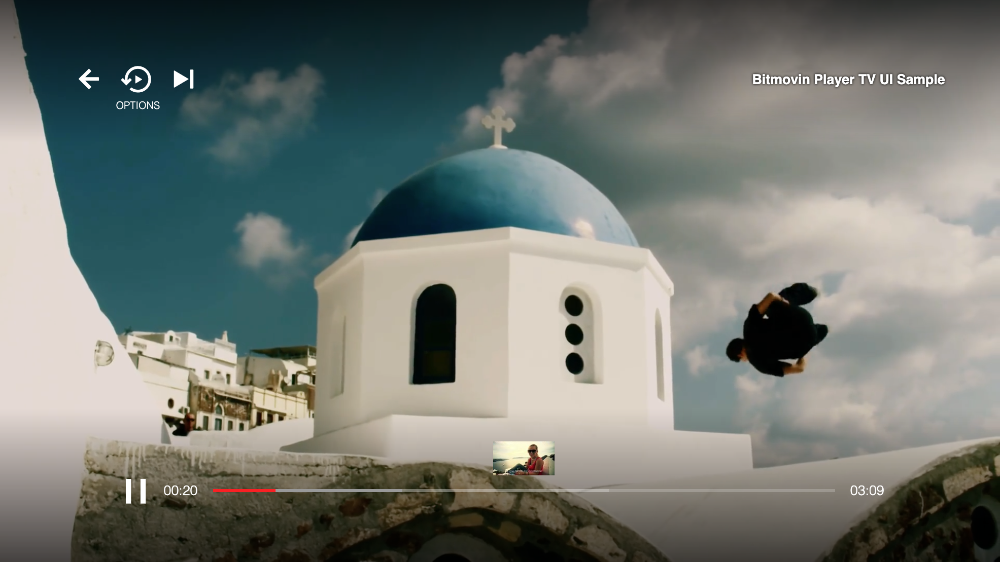
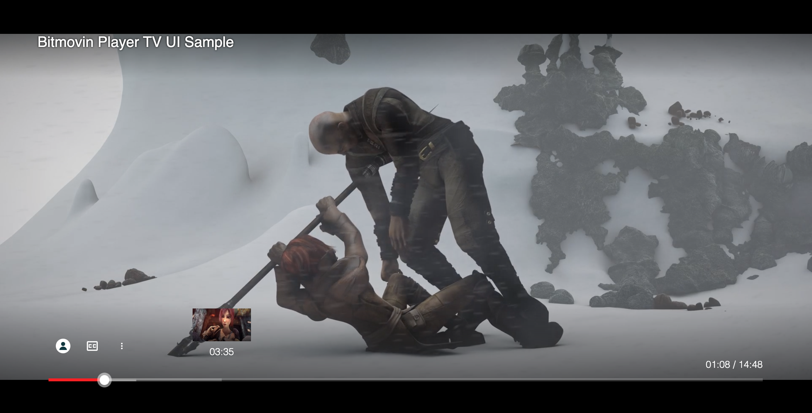

# Bitmovin Adaptive Streaming Player for MPEG-DASH & HLS
These examples are build around the Bitmovin Adaptive Streaming Player, demonstrating usage and capabilities of the HTML5 based HLS and MPEG-DASH player.

**Table of Content**

* [Available Sample Apps](#available-sample-apps)
* [Sample Apps Setup Instructions](#sample-apps-setup-instructions)
* [Documentation & Release Notes](#documentation--release-notes)
* [Support](#support)

---

## Available Sample Apps

### Basics
* [**events**](events/)
  * [ON_DOWNLOAD_FINISHED](events/onDownloadFinished.html): Report download errors for live streams using the ON_DOWNLOAD_FINISHED player event.
  * [eventConstants](events/eventConstants.html): Use event constants for registering event handlers at the player.
  * [ON_SEGMENT_REQUEST_FINISHED](events/onSegmentRequestFinished.html): Use ON_SEGMENT_REQUEST_FINISHED event to analyze which segment has been downloaded and implement custom workflows according to the HTTP status code.
* [**playlist**](playlist/)
  * [simplePlaylist](playlist/simplePlaylist.html): Build a playlist with the Bitmovin HTML5 Player API.
* [**requirejs-demo**](requirejs-demo/)
  * [buildPlayerWithRequirejs](requirejs-demo/buildPlayerWithRequirejs.html): Build the Bitmovin HTML5 Player using requirejs.
* [**webpack-demo**](webpack-demo/)
  * [buildPlayerWithWebpack](webpack-demo/buildPlayerWithWebpack.html): Build the Bitmovin HTML5 Player using webpack.
* [**errorHandling**](errorhandling/)
  * [handleDownloadErrors](errorhandling/handleDownloadErrors.html): Custom retry logic for the case that files cannot be downloaded.
  * [showPosterOnError](errorhandling/showPosterOnError.html): Display a still image whenever an error occurs.
  * [switchQualityOnHttpStatusCode](errorhandling/switchQualityOnHttpStatusCode.html): Tweak the ABR behavior based on HTTP errors.
* [**Typescript**](typescript/)
  * [buildWithEsbuildTsc](typescript/buildWithEsbuildTsc.html): Build a sample using Typescript, its `tsc` compiler and `esbuild`.

### Playback & Casting
* [**CAF Receiver**](https://github.com/bitmovin/bitmovin-player-caf-receiver): Example of a Chromecast Application Framework (CAF) receiver app, also known as cast receiver v3 SDK.
* [**keyboard**](keyboard/)
  * [keyboardSupport](keyboard/keyboardSupport.html): Keyboard shortcuts for the Bitmovin Player.
  * [keyboardCustom](keyboard/keyboardCustom.html): Custom keyboard shortcuts for the Bitmovin Player.
* [**mobile**](mobile/)
  * [android MediaSessionAPI](mobile/androidMediaSessionAPI.html): Control playback via Android Notifications
  
### Advertising
* [**ssai**](ssai/)
  * [dfp](ssai/dfp/): Use Google DoubleClick for Server-side ad insertion (SSAI)
  * [Yospace](ssai/yospace/): Use Yospace for Server-side ad insertion

### UI/UX & Subtitles
* [**playerUi**](playerUi/)
  * [customErrorMessage](playerUi/customErrorMessage.html): Display your own error messages within the Bitmovin HTML5 Player
  * [timelineMarkers](playerUi/timelineMarkers.html): Identify the differents parts of a stream by setting some markers over the timeline
  * [timelineMarkersLive](playerUi/timelineMarkersLive.html): Using timeline markers for live streams
  * [timelineMarkersWithImages](playerUi/timelineMarkersWithImages.html): Passing imageUrl with timeline marker
  * [separatedSubtitleAudioSettings](playerUi/separatedAudioSubtitleSettings.html): Extracted audio tracks and subtitle settings from the settings panel direct into the controlBar
  * [labeling](playerUi/labeling.html): Change Languages, Quality and Subtitles labels
  * [customForwardRewindButtons](playerUi/customForwardRewindButtons.html): Custom Forward & Rewind Buttons
  * [playbackControlsUiWithImaAds](playerUi/playbackControlsUiWithImaAds.html) : Adding playback controls UI during Ads playback with IMA SDK
  * [**TV UI**](playerUi/tv)
    * [disney](playerUi/tv/disney/index.html): Customized TV UI in the style of Disney Plus
       

    * [netflix](playerUi/tv/netflix/index.html): Customized TV UI in the style of Netflix
       

    * [youtube](playerUi/tv/youtube/index.html): Customized TV UI in the style of Youtube
       
* [**subtitles**](subtitles/)
  * [customSubtitleDisplay](subtitles/customSubtitleDisplay.js): Render subtitles using the ON_CUE_ENTER and ON_CUE_EXIT player events.
  * [uiSubtitleOverlay](subtitles/uiSubtitleOverlay.html): Use only the SubtitleOverlay from the [Bitmovin Player UI](https://github.com/bitmovin/bitmovin-player-ui) but not the rest of the UI.

### UI Frameworks
* [**angular**](angular/)
  * [buildPlayerWithNpm](angular/src/app/bitmovin-player/bitmovin-player.component.ts): Using the Bitmovin NPM package
* [**react**](react/)
  * [reactJs](react/reactjs.html): Using the Bitmovin Player within a react component
  * [buildPlayerWithBundledNpmClassBased](react/bundled-player/class-based/src/bitmovinPlayer.js): Using the Bitmovin Monolithic NPM package on a class based React component.
  * [buildPlayerWithBundledNpmFunctionBased](react/bundled-player/function-based/src/bitmovinPlayer.js): Using the Bitmovin Monolithic NPM package on a function based React component.
  * [buildPlayerReactPackageFunctionBased](react/bundled-player/package-based/src/App.tsx): Using the Bitmovin React NPM package on a function based React component.
  * [buildPlayerReactPackageWithConvivaFunctionBased](react/bundled-player/package-based-with-conviva/src/App.tsx): Using the Bitmovin React NPM package on a function based React component with Conviva integration.
  * [buildPlayerWithModularNpmClassBased](react/modular-player/class-based/src/bitmovinPlayer.js): Using the Bitmovin Modular NPM package on a class based React component.
  * [buildPlayerWithModularNpmFunctionBased](react/modular-player/function-based/src/bitmovinPlayer.js): Using the Bitmovin Modular NPM package on a function based React component.
* [**vue**](vue)
  * [vueJs](vue/vuejs.html): Using the Bitmovin Player within a vue.js component
  
### Specific Use Cases
* [**adaptation**](adaptation/)
    * [preferredStartupQuality](adaptation/preferredStartupQuality.js): Set a minimum startup quality for a specified amount of time before using the built-in adaptation logic again.
    * [regionOfInterest](adaptation/regionOfInterest.html): Multiple players with low quality and the active player (where the mouse is over) switches to better quality.
    * [rateBasedSwitching](adaptation/rateBasedSwitching.js): Measuring the speed of downloads and select the quality accordingly.
* [**frameaccurate**](frameaccurate/)
    * [Frame Accurate Control](frameaccurate/js/FrameAccurateControls.ts): Bitmovin Player Wrapper for SMTPE timestamp seeking + stepping
* [**streamRecovery**](streamRecovery/)
    * [liveStreamRecovery](streamRecovery/liveStreamRecovery.js): Automatically restart live streams if too many download errors happened e.g. to get over missing segments.
* [**ssai**](ssai/)
    * [Google AdManager](ssai/dfp/): Use Google AdManager for Server-side ad insertion (SSAI)
    * [Yospace](ssai/yospace/): Use Yospace for Server-side ad insertion
* [**subtitles**](subtitles/)
    * [customSubtitleDisplay](subtitles/customSubtitleDisplay.js): Render subtitles using the ON_CUE_ENTER and ON_CUE_EXIT player events.
* [**vue**](vue)
    * [vueJs](vue/vuejs.html): Using the Bitmovin Player within a vue.js component
* [**webpack-demo**](webpack-demo/)
    * [buildPlayerWithWebpack](webpack-demo/buildPlayerWithWebpack.html): Build the Bitmovin HTML5 Player using webpack.
* [**webapi-pip**](webapi-pip/)
    * [pictureInPicture](webapi-pip/index.html): Integrate the Bitmovin HTML5 Player with the Picture-In-Picture(PiP) Web Api
* [**Media Session API**](media-session-api/index.ts): Leverage the browser's Media Session API to show the user in system notifications what's being played and control the player from there.
* [**CMCD**](cmcd/index.ts): Enable Common Media Client-Data (CMCD) to be send along with requests to the CDN.

## Sample Apps Setup Instructions

1. [Sign up](https://bitmovin.com/dashboard/signup) for free
2. Get your personal key from the [player licenses page](https://bitmovin.com/dashboard/player/licenses/)
3. Checkout the sample provided in this repository
4. Add the player key to the player configuration in the example you want to use
5. Enjoy best adaptive streaming performance!

## Generate Content The Easy Way

To generate MPEG-DASH & HLS content on your own, please have a look at the [encoding section](https://bitmovin.com/docs/encoding) and give it a free try!

## Additional Demos and Documentation

Additional demos can be found in our [demo area](https://bitmovin.com/demos/). For more information on our rich API and player configuration, we refer to our [documentation](https://bitmovin.com/docs/player).

[www.bitmovin.com](https://www.bitmovin.com) 

## Documentation & Release Notes

+ **Web API Reference documentation** - You can find the latest one [here](https://bitmovin.com/docs/player/api-reference/web/web-sdk-api-reference-v8)
+ **Web SDK Release Notes** can be found [here](https://bitmovin.com/docs/player/releases/web)

## Support
If you have any questions or issues with this SDK or its examples, or you require other technical support for our services, please login to your Bitmovin Dashboard at https://bitmovin.com/dashboard and [create a new support case](https://bitmovin.com/dashboard/support/cases/create). Our team will get back to you as soon as possible :+1:
